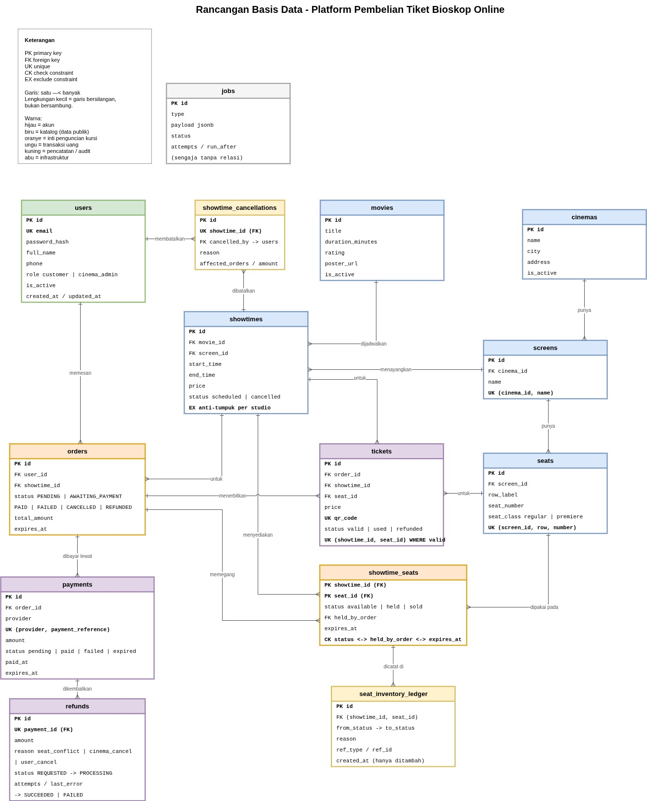

# Backend Development Test - Mitra Kasih Perkasa 2025

| | |
| --- | --- |
| **Nama** | **Ariyanto Muhammad** |
| Tanggal | 17 September 2026 |
| Email | mhm.ariyanto@gmail.com |
| Phone | 082245750310 |
| Repository | https://github.com/arikmhm/Backend_Test_MKP |

Platform pembelian tiket bioskop online untuk jaringan berskala nasional.

## Letak jawaban

| Poin soal | Ada di |
| --- | --- |
| Instruksi 1 - topologi sistem, export JPG | [`docs/diagrams/1-topologi-sistem.jpg`](docs/diagrams/1-topologi-sistem.jpg) |
| A.1 - flowchart yang dapat dipahami orang awam | [`docs/diagrams/2-perjalanan-customer.jpg`](docs/diagrams/2-perjalanan-customer.jpg) |
| A.2 - pemilihan kursi, restok tiket, refund dari bioskop | [`docs/system-design.md`](docs/system-design.md) bagian 3, 4, dan 5 |
| Instruksi 2 - database design + script PostgreSQL | [`docs/erd.md`](docs/erd.md), [`db/schema.sql`](db/schema.sql) |
| C - API login user + CRUD jadwal tayang | [`cmd/api`](cmd/api), [`internal/`](internal) |
| Instruksi 4 - export Postman | [`postman/`](postman) |




## Menjalankan

Butuh Go 1.25 atau lebih baru, dan PostgreSQL 13 atau lebih baru dengan
extension `btree_gist`.

```bash
createdb mkp_cinema
psql -d mkp_cinema -f db/schema.sql
psql -d mkp_cinema -f db/seed.sql
```

```bash
cp .env.example .env      # sesuaikan DATABASE_URL, isi JWT_SECRET min. 32 karakter
set -a; source .env; set +a
go run ./cmd/api
```

Pengujian:

```bash
go test ./...
psql -d mkp_cinema -f db/verify.sql   # 13 uji perilaku rancangan, di-ROLLBACK
```

Untuk Postman, impor
[`postman/MKP-Cinema-API.postman_collection.json`](postman/MKP-Cinema-API.postman_collection.json)
lalu jalankan lewat Runner berurutan dari folder 1, karena folder itu yang
menyimpan token untuk folder berikutnya.

## Endpoint

| Method | Path | Token | `cinema_admin` |
| --- | --- | :---: | :---: |
| `POST` | `/api/auth/login` | | |
| `GET` | `/api/auth/me` | ya | |
| `GET` | `/api/showtimes` | ya | |
| `GET` | `/api/showtimes/{id}` | ya | |
| `POST` | `/api/showtimes` | ya | ya |
| `PUT` | `/api/showtimes/{id}` | ya | ya |
| `DELETE` | `/api/showtimes/{id}` | ya | ya |

`GET` ikut dikunci token karena soal menyebut CRUD jadwal tayang memakai
Authorization dari poin 1. Pada produk sebenarnya daftar jadwal adalah katalog
publik, seperti dirancang pada Poin A.

Akun dari `seed.sql`:

| Email | Kata sandi | Role |
| --- | --- | --- |
| `admin@mkp.test` | `admin123` | `cinema_admin` |
| `budi@mail.test` | `password123` | `customer` |

## Catatan

Routing memakai `net/http` bawaan Go, tanpa framework. Query ditulis tangan
dengan `pgx` tanpa ORM, karena rancangannya bertumpu pada `EXCLUDE USING gist`
dan partial unique index, dan galat constraint dari PostgreSQL itu yang dipakai
untuk menentukan kode HTTP.

Alasan tiap keputusan ada di [`docs/system-design.md`](docs/system-design.md).
