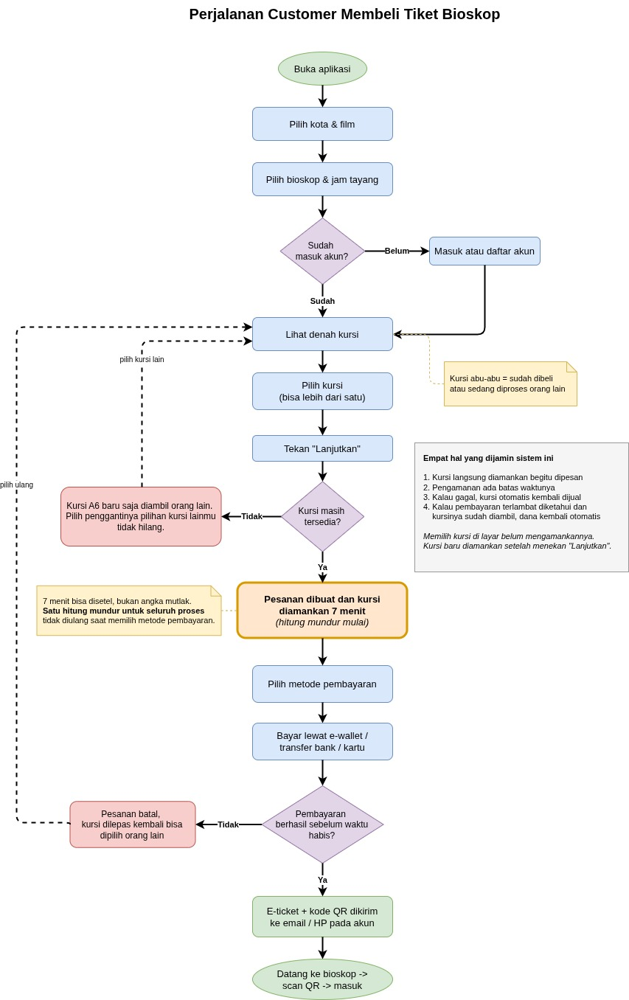
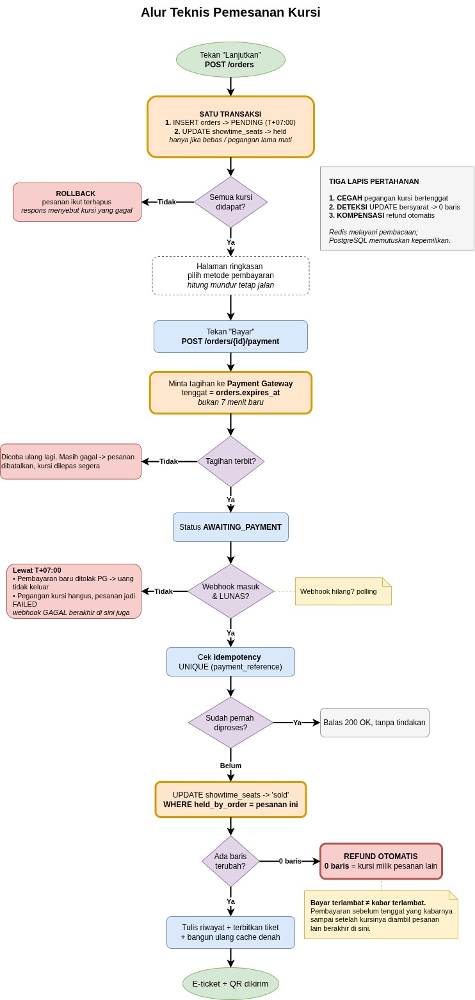
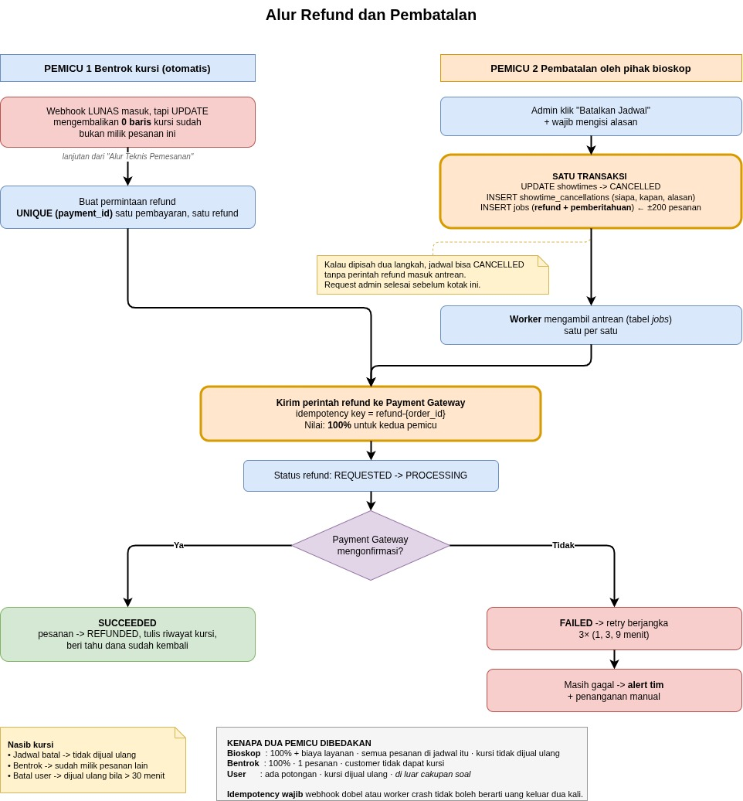
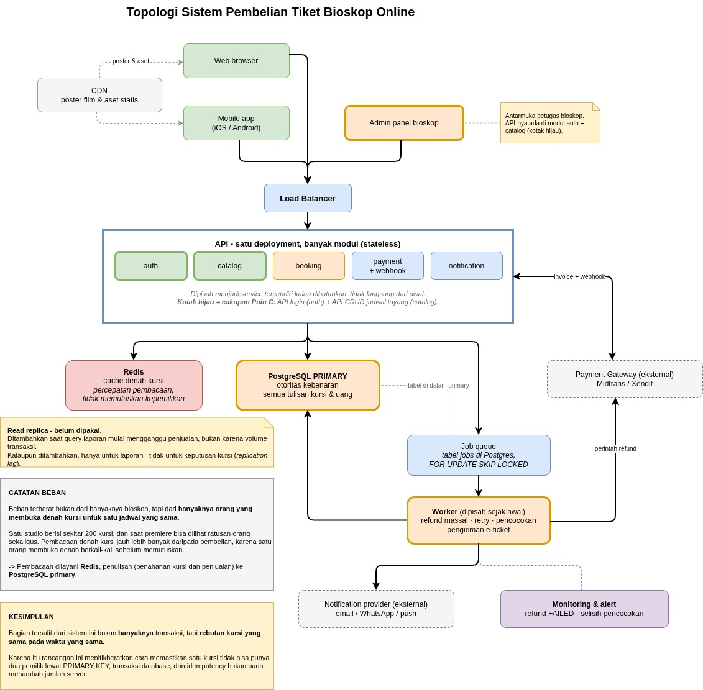

# System Design - Platform Pembelian Tiket Bioskop Online

Backend Development Test, Mitra Kasih Perkasa 2025 - Poin A

Soal minta tiga hal dijelaskan: cara memilih tempat duduk supaya tetap benar
walau diakses banyak orang, cara restok tiket yang sudah terjual, dan alur
refund kalau bioskop yang membatalkan. Saya bahas ketiganya di bawah, dengan
gambarnya langsung di bagian yang bersangkutan.

## Masalah yang saya kejar

Kalimat yang saya pegang dari soal:

> "customer dapat melakukan transaksi kapanpun secara online tanpa khawatir
> mengenai nomor kursi tempat duduk karena tidak akan digunakan oleh orang lain"

Bagi saya itu satu masalah yang cukup spesifik: ada jeda antara "saya pilih
kursi" dan "uangnya benar-benar masuk". User pilih kursi, pilih metode bayar,
buka aplikasi bank, bayar, lalu notifikasinya sampai ke sistem. Jedanya bisa
beberapa menit.

Selama jeda itu kursi A5 milik siapa? Kalau belum milik siapa-siapa sampai
lunas, dua orang bisa bayar untuk kursi yang sama. Kalau langsung jadi miliknya
selamanya begitu diklik, satu orang bisa memblokir seluruh studio tanpa pernah
bayar.

Jadi saya buat kursi dipegang sementara, 7 menit. Cukup untuk menyelesaikan
pembayaran di aplikasi bank, dan tidak terlalu lama menahan kursi kalau orangnya
tidak jadi beli. Angkanya saya taruh di konfigurasi, bukan di kode, karena nilai
yang pas hanya bisa ditentukan dari data pembayaran yang sebenarnya. Tenggat lain
di rancangan ini semuanya ikut angka itu.

## Alur yang dilihat customer

Flowchart untuk Tugas A.1:



Sumber: [`2-perjalanan-customer.drawio`](diagrams/2-perjalanan-customer.drawio)

Di belakangnya, semuanya berputar pada satu siklus hidup kursi:

```
available ──► held (sementara) ──► sold ──► refunded
    ▲              │                            │
    └──────────────┴────────────────────────────┘
        kembali tersedia (restok)
```

Tiga pertanyaan di Tugas A.2 sebenarnya tiga potongan dari siklus itu. Pemilihan
kursi adalah `available → held → sold`, restok adalah jalan pulangnya ke
`available`, dan refund adalah `sold → refunded` beserta urusan uangnya.

## Pemilihan kursi

Cara yang paling sering saya lihat justru punya lubang:

```
1. cek ke database: kursi A5 masih kosong?
2. kalau kosong, simpan A5 atas nama user ini
```

Di antara dua langkah itu ada jeda. Dua permintaan yang datang hampir bersamaan
bisa lolos berdua sebelum salah satunya menyimpan:

```
10:00.000   Budi  : cek A5 → kosong
10:00.001   Siti  : cek A5 → kosong     (Budi belum sempat menyimpan)
10:00.002   Budi  : simpan A5
10:00.003   Siti  : simpan A5
```

Mengecek lebih teliti tidak menolong, karena jedanya selalu ada. Yang saya pilih
adalah menyerahkan aturannya ke database.

Satu kursi pada satu jadwal saya beri satu baris, dibuat otomatis begitu
jadwalnya dibuat:

```sql
CREATE TABLE showtime_seats (
  showtime_id   BIGINT      NOT NULL REFERENCES showtimes(id),
  seat_id       BIGINT      NOT NULL REFERENCES seats(id),
  status        TEXT        NOT NULL DEFAULT 'available',  -- available | held | sold
  held_by_order BIGINT,
  expires_at    TIMESTAMPTZ,
  PRIMARY KEY (showtime_id, seat_id)
);
```

`PRIMARY KEY (showtime_id, seat_id)` bikin satu kursi hanya punya satu baris.
Pemilik kedua jadi bukan ditolak karena ada yang memeriksa, tapi karena tidak ada
tempat untuknya.

Klaimnya satu perintah:

```sql
UPDATE showtime_seats
SET    status = 'held', held_by_order = $3,
       expires_at = now() + interval '7 minutes'
WHERE  showtime_id = $1 AND seat_id = $2
  AND  (status = 'available'
        OR (status = 'held' AND expires_at <= now()))   -- pegangan lama sudah mati
RETURNING seat_id;
```

Memeriksa dan mengubah jadi satu operasi, jadi tidak ada jeda yang bisa disela.
Satu baris kembali berarti kursi sah dipegang pesanan ini. Nol baris berarti
kursi sudah dipegang orang lain atau sudah terjual, dan permintaannya saya tolak
dengan pesan "kursi baru saja diambil pengguna lain".

Soal juga minta rancangan ini tetap bisa diakses banyak orang. PostgreSQL hanya
mengunci baris kursi itu selama `UPDATE` jalan, jadi dua permintaan untuk kursi
yang sama dievaluasi berurutan sementara kursi lain di studio yang sama tidak
terganggu. Antreannya hanya di antara orang yang memang berebut kursi yang sama
persis.

Saya pilih menolak yang kalah daripada mengunci lebih awal lalu bikin orang
menunggu. Bentrokan per kursi jarang; yang ramai itu jadwal tayangnya. Dan kalau
memang bentrok, "kursi sudah diambil" itu jawaban yang benar, karena menunggu
tidak mengubah hasilnya.

### Urutan pemesanan



Sumber: [`3-alur-teknis-pemesanan.drawio`](diagrams/3-alur-teknis-pemesanan.drawio)

Pembeliannya lewat dua halaman dan dua panggilan API:

```
[daftar film, bioskop, jam tayang]    ← data publik, bisa di-cache
     │  ┌── GERBANG: harus masuk akun
     ▼  ▼
[halaman denah kursi]
     │ tekan "Lanjutkan"
     ▼  POST /orders                  → pesanan PENDING + kursi dipegang,
     │                                  hitung mundur MULAI
[halaman ringkasan pesanan]           ← user memilih metode pembayaran
     │ tekan "Bayar"
     ▼  POST /orders/{id}/payment     → minta tagihan ke payment gateway
[halaman instruksi pembayaran]        ← Virtual Account / QR + hitung mundur
```

Gerbang akun saya taruh sebelum denah kursi. Kalau akun baru diminta setelah
kursi dipilih, user sudah mengerjakan sesuatu lalu disuruh mendaftar, dan
pendaftaran bisa makan beberapa menit karena verifikasi email atau OTP. Begitu
dia kembali, kursinya bisa sudah diambil orang. Letak itu juga pas di batas
antara data publik (kota, film, jam tayang) dan data rebutan (denah kursi).
Konsekuensinya daftar jam tayang tidak saya beri indikator sisa kursi.

Kursi dipegang di panggilan pertama, saat user meninggalkan halaman denah kursi.
Kalau baru dipegang di panggilan kedua, dua orang bisa duduk di halaman ringkasan
untuk kursi yang sama, dan yang kalah baru ditolak setelah memilih metode bayar.

Pesanannya dibuat lebih dulu karena `held_by_order` menunjuk ke `orders.id`:
pemegang kursi harus punya identitas, dan identitasnya itu pesanannya sendiri.

| Status | Artinya | User bisa membayar? |
| ------ | ------- | ------------------- |
| `PENDING` | Pesanan dibuat, kursi sudah dipegang, tagihan belum terbit | Belum |
| `AWAITING_PAYMENT` | Tagihan terbit (Virtual Account / QR sudah ada) | Ya |
| `PAID` | Pembayaran terkonfirmasi, tiket terbit | - |
| `FAILED` | Tenggat terlewat, atau pembayaran ditolak | - |
| `CANCELLED` | Dibatalkan user atau pihak bioskop | - |
| `REFUNDED` | Dana sudah dikembalikan | - |

`PENDING` bukan status sekejap. Dia dihuni selama user memilih metode bayar, bisa
satu sampai dua menit, dan panggilan ke payment gateway sendiri juga bisa gagal.
Kalau tagihan gagal terbit dan percobaan ulangnya tetap gagal, pesanan saya
batalkan dan kursinya dilepas saat itu juga, tidak menunggu 7 menit habis.

### Beberapa kursi sekaligus, dan peran Redis

Orang nonton berdua atau bertiga, jadi klaim beberapa kursi saya buat
semua-atau-tidak. Kalau A6 keburu diambil, A5 dan A7 tidak boleh tetap tertahan.
Ketiganya jalan dalam satu transaksi, dan kalau baris yang berubah lebih sedikit
dari kursi yang diminta, semuanya di-`ROLLBACK`.

Satu hal yang saya jaga di situ: kalau Budi pilih [A5, A6] dan Siti pilih
[A6, A5] bersamaan, keduanya bisa saling menunggu kunci yang dipegang lawannya.
Jadi kursi selalu saya kunci berurutan dari nomor terkecil, lewat
`ORDER BY seat_id ... FOR UPDATE`.

Soal Redis: beban terbesar sistem ini bukan pembelian, tapi pembacaan denah
kursi. Satu orang buka denah berkali-kali sebelum memutuskan, dan satu jadwal
populer bisa dibuka ratusan orang sekaligus. Jadi denah kursi saya layani dari
Redis, dan hanya itu tugas Redis di sini.

Redis sengaja tidak ikut menahan kursi. Begitu penahanan dipegang perintah
bersyarat di atas, kunci tambahan di Redis tidak menambah keamanan, hanya
menambah satu cara gagal: kalau proses mati setelah memasang kunci tapi sebelum
menulis ke database, kuncinya menggantung untuk kursi yang sebenarnya tidak
dipegang siapa pun. Kalau Redis mati total, pembacaan jatuh ke PostgreSQL dan
sistemnya jadi lebih lambat, tapi tidak pernah menjual kursi yang sama dua kali.

## Restok dan pencatatan

Kursi kembali tersedia di empat kejadian:

| Kejadian | Pemicu |
| -------- | ------ |
| Masa tahan habis tanpa pembayaran | waktu |
| Pembayaran gagal atau ditolak | webhook dari payment gateway |
| Dibatalkan user sebelum tayang | user (dijual ulang kalau masih lebih dari 30 menit sebelum jam tayang) |
| Jadwal dibatalkan pihak bioskop | admin (tidak dijual ulang, jadwalnya mati) |

Untuk yang pertama saya tidak pakai cron job. Kalau cron-nya mati sepuluh menit,
bioskop berhenti menjual kursi yang seharusnya sudah bebas dan tidak ada yang
tahu. Yang saya pakai: kursi menyimpan waktu kedaluwarsanya, dan pegangan yang
sudah lewat waktu otomatis boleh diambil alih lewat klausa `expires_at <= now()`
di perintah klaim tadi. Restoknya jadi bagian dari proses klaim itu sendiri,
bukan pekerjaan terpisah yang bisa gagal diam-diam. Program pembersih tetap ada
untuk merapikan data dan kirim metrik, tapi kalau dia mati, sistemnya tetap
benar.

Soal pencatatan, menyimpan status terkini saja tidak cukup. Kalau kolom `status`
ditimpa terus, begitu ada keluhan "saya sudah bayar tapi kursi saya diambil
orang", yang kelihatan di database hanya satu kata tanpa keterangan kapan
berubah, karena apa, dan oleh siapa.

Jadi tiap perpindahan keadaan kursi juga saya catat di tabel yang hanya bisa
ditambah:

```
seat_inventory_ledger
| waktu    | showtime | seat | dari      | ke        | sebab           | ref       |
|----------|----------|------|-----------|-----------|-----------------|-----------|
| 19:12:40 | 101      | A5   | HELD      | SOLD      | payment_settled | pay#5521  |
| 20:30:00 | 101      | A5   | SOLD      | REFUNDED  | cinema_cancel   | refund#77 |
```

Ada tiga gunanya. Sengketa bisa dibuktikan karena ada jejak waktu dan sebabnya.
Laporan penjualan per cabang tinggal diambil, termasuk persentase pegangan yang
hangus, yang kalau tinggi berarti alur pembayarannya bermasalah. Dan jumlah
perpindahan ke `SOLD` bisa dicocokkan dengan uang yang masuk, jadi selisihnya
ketahuan di transaksi mana.

Kolom `status` tetap ada supaya denah kursi cepat dibaca. Tabel riwayat ini
sejarahnya, dan keduanya ditulis dalam satu transaksi.

## Refund dan pembatalan dari bioskop



Sumber: [`4-alur-refund.drawio`](diagrams/4-alur-refund.drawio)

Soal menyebut pembatalan dari pihak bioskop, misalnya proyektor rusak atau film
ditarik distributor. Ini beda jauh dari user yang membatalkan sendiri:

| | Dibatalkan user | Dibatalkan bioskop |
| --- | --- | --- |
| Pihak yang keliru | User | Bioskop |
| Nilai pengembalian | Sesuai kebijakan potongan | 100%, termasuk biaya layanan |
| Cakupan | 1 pesanan | Seluruh pemesanan pada jadwal itu (bisa ±200) |
| Nasib kursi | Dijual ulang | Tidak, jadwalnya sendiri mati |

Kalau 200 refund dikerjakan langsung di dalam permintaan admin, permintaannya
akan kehabisan waktu di tengah jalan dan tidak ada yang tahu mana yang sudah
diproses. Kalau admin lalu klik ulang, sebagian refund bisa terkirim dua kali.

Jadi permintaan admin hanya mencatat keputusannya, dalam satu transaksi:

```sql
BEGIN;
  UPDATE showtimes SET status = 'CANCELLED' WHERE id = $1;
  INSERT INTO showtime_cancellations (showtime_id, admin_id, reason) VALUES (...);
  INSERT INTO jobs (type, payload)
    SELECT 'refund', jsonb_build_object('order_id', id)
    FROM orders WHERE showtime_id = $1 AND status = 'PAID';   -- ±200 baris
  INSERT INTO jobs (type, payload)
    SELECT 'notify_cancellation', jsonb_build_object('order_id', id)
    FROM orders WHERE showtime_id = $1 AND status = 'PAID';
COMMIT;
```

Semuanya harus satu transaksi. Kalau daftar pekerjaan refundnya ditulis di
langkah terpisah, bisa terjadi jadwal tercatat dibatalkan sementara perintah
refundnya tidak pernah masuk daftar: 200 orang tidak dapat uangnya kembali, dan
tidak ada error apa pun yang muncul.

Pemberitahuan ke customer ikut masuk antrean di transaksi yang sama, tapi
terpisah dari refundnya, karena waktunya beda. Refund bisa satu sampai tujuh hari
kerja, sedangkan customer perlu tahu sekarang supaya tidak berangkat ke bioskop
untuk jadwal yang sudah tidak ada. Catatan pembatalannya juga menyimpan siapa
admin yang membatalkan, kapan, alasannya, serta berapa pesanan dan nilai yang
terdampak.

Pekerjaan refundnya dijalankan worker di latar belakang. Daftar pekerjaannya saya
simpan sebagai tabel di PostgreSQL, bukan message broker tersendiri, supaya bisa
ikut satu transaksi seperti di atas dan tidak menambah komponen yang harus
dipasang dan diawasi. Worker mengambilnya dengan
`SELECT ... FOR UPDATE SKIP LOCKED` supaya beberapa worker bisa jalan dari daftar
yang sama tanpa saling menunggu.

Refund sendiri bisa gagal, karena uangnya ada di bank atau e-wallet dan kartunya
bisa kedaluwarsa. Jadi refund punya status sendiri:

```
REQUESTED ──► PROCESSING ──► SUCCEEDED
                          └─► FAILED ──► dicoba ulang 3× (1, 3, 9 menit)
                                      └─► masih gagal: alert ke tim
```

Kalau `SUCCEEDED`, pesanannya jadi `REFUNDED`, perpindahan kursi dicatat di tabel
riwayat, dan customer dikabari. Kalau `FAILED`, itu wajib memicu alert, karena
artinya ada uang customer yang tersangkut dan orangnya belum tentu mengeluh.

Yang paling saya jaga di bagian ini: satu pembayaran hanya boleh direfund sekali.
Notifikasi gateway bisa datang dua kali, worker bisa mati setelah mengirim
perintah tapi sebelum mencatatnya, dan admin bisa klik "Batalkan" berkali-kali.
Penjagaannya di dua tempat. `UNIQUE (payment_id)` di tabel `refunds` menolak
percobaan kedua di database, dan tiap perintah ke gateway membawa kunci yang sama
(`refund-{order_id}`) supaya gateway mengenali permintaan berulang.

## Soal notifikasi pembayaran

Uangnya dipegang pihak ketiga, dan webhook-nya bisa terlambat, dobel, atau
hilang. Dua hal yang saya siapkan, keduanya karena menyentuh kepemilikan kursi.

Tenggat tagihan saya samakan dengan tenggat pegangan kursi. Saat minta tagihan,
sistem meneruskan `orders.expires_at` apa adanya, bukan "7 menit dari sekarang".
Jadi berapa lama pun user memilih metode bayar, tenggatnya tidak bergeser dan
hitung mundur yang dia lihat tetap satu dari awal sampai akhir. Pembayaran yang
lewat tenggat ditolak gateway, jadi uangnya tidak keluar.

Notifikasi dobel ditangkis `UNIQUE (provider, payment_reference)`. Pemrosesan
kedua tidak melakukan apa-apa dan tetap dijawab `200 OK`.

Sisanya tidak bisa dicegah, hanya dikompensasi: user bayar sebelum tenggat tapi
kabarnya sampai setelah kursinya diambil pesanan lain. Di situ perintah
`UPDATE ... AND held_by_order = pesanan ini` mengembalikan nol baris, dan sistem
langsung menjalankan refund otomatis.

Menariknya ini tidak selalu berujung refund. Pegangan kursi yang kedaluwarsa
tidak dihapus siapa pun, `held_by_order` tetap berisi nomor pesanan yang lama.
Jadi kalau ternyata tidak ada yang mengambil kursi itu selama jedanya, syaratnya
masih terpenuhi dan tiketnya tetap terbit. Refund otomatis hanya terjadi kalau
kabarnya terlambat dan kursinya benar-benar diperebutkan.

Untuk notifikasi yang hilang, sistem menanyakan status ke gateway sekali sebelum
pegangan kursi dilepas, dan ada pencocokan harian dengan laporan gateway.

## Topologi



Sumber: [`1-topologi-sistem.drawio`](diagrams/1-topologi-sistem.drawio)

Aturan saya saat menyusunnya, tiap komponen harus bisa dijawab "kenapa ini ada?".

| Komponen | Tanggung jawab |
| -------- | -------------- |
| API (satu deployment, banyak modul, *stateless*) | Seluruh logika. Tidak menyimpan keadaan di memorinya sendiri, jadi jumlah instance bisa ditambah atau dikurangi bebas |
| Worker (dipisah sejak awal) | Refund massal, percobaan ulang, pencocokan, pengiriman e-ticket |
| Redis | Cache denah kursi. Mempercepat pembacaan, tidak ikut memutuskan kepemilikan |
| PostgreSQL primary | Penentu kebenaran. Semua penulisan kursi dan uang |
| Monitoring dan alert | Refund gagal dan selisih pencocokan harus ada yang mengetahui |

Modul `auth`, `catalog`, `booking`, `payment`, dan `notification` saya gambar di
dalam satu deployment, bukan layanan terpisah. Memisahkannya dari awal menambah
biaya nyata, yaitu transaksi lintas layanan dan penelusuran masalah yang
menyebar, tanpa manfaat di skala ini. Yang saya pisah dari awal hanya worker,
karena sifat kerjanya beda: jalan di latar belakang, punya percobaan ulang
sendiri, dan tidak terikat permintaan HTTP.

Bagian yang saya implementasikan di Poin C, yaitu API login dan CRUD jadwal
tayang, ada di modul `auth` dan `catalog`. Di kode keduanya jadi paket
`internal/auth` dan `internal/showtime`.

## Batasan

Ini rancangan, belum sistem yang berjalan. Beberapa hal yang perlu saya sebut
terus terang:

- Perkiraan bebannya asumsi, bukan data lapangan. Yang saya jadikan dasar hanya
  sifat bebannya: pembacaan denah kursi jauh lebih banyak daripada pembelian, dan
  yang terberat menumpuk di satu jadwal yang sama.
- Yang benar-benar saya implementasikan hanya Poin C. Modul `booking`, `payment`,
  dan `notification` di topologi baru sampai tahap rancangan.
- Hal seperti tenggat pembayaran absolut, pencocokan berkala, dan refund otomatis
  saya sertakan karena menurut analisa saya kasusnya akan terjadi di sistem
  seperti ini, bukan karena saya sudah pernah menanganinya di produksi.
- Angka 7 menit dan 30 menit itu nilai awal di konfigurasi, dipilih karena
  sebanding dengan waktu yang umumnya dibutuhkan untuk membayar, bukan hasil
  pengukuran.
- Midtrans, Xendit, dan nama produk lain yang saya sebut hanya contoh. Yang saya
  tetapkan perannya di dalam sistem.
- Yang belum saya rancang: angka pembatasan kuota per akun di halaman denah
  kursi, dan perilaku sistem kalau payment gateway tidak bisa dihubungi lama.
